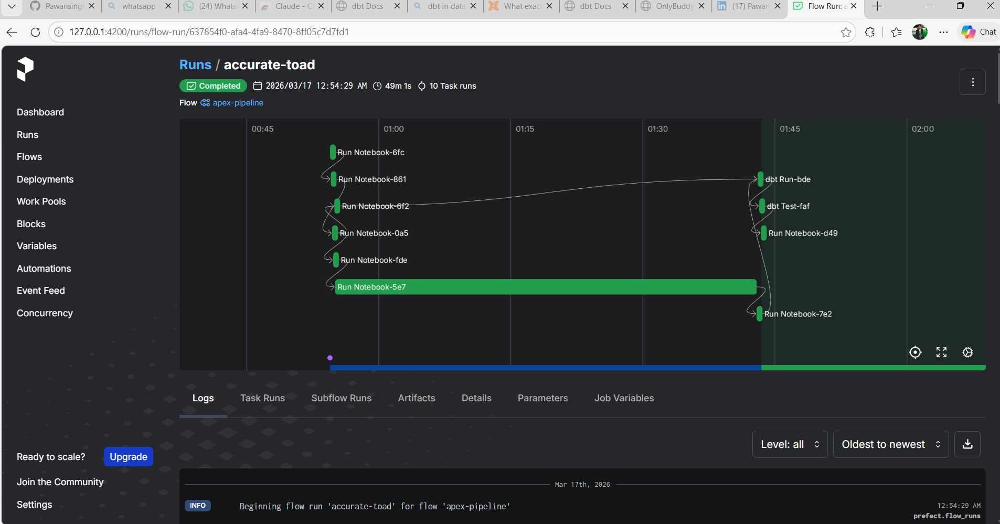
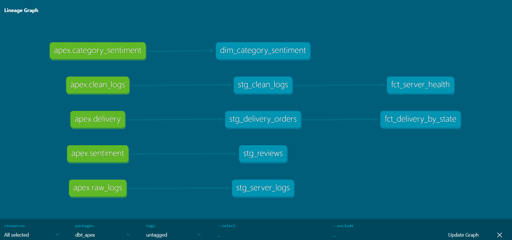
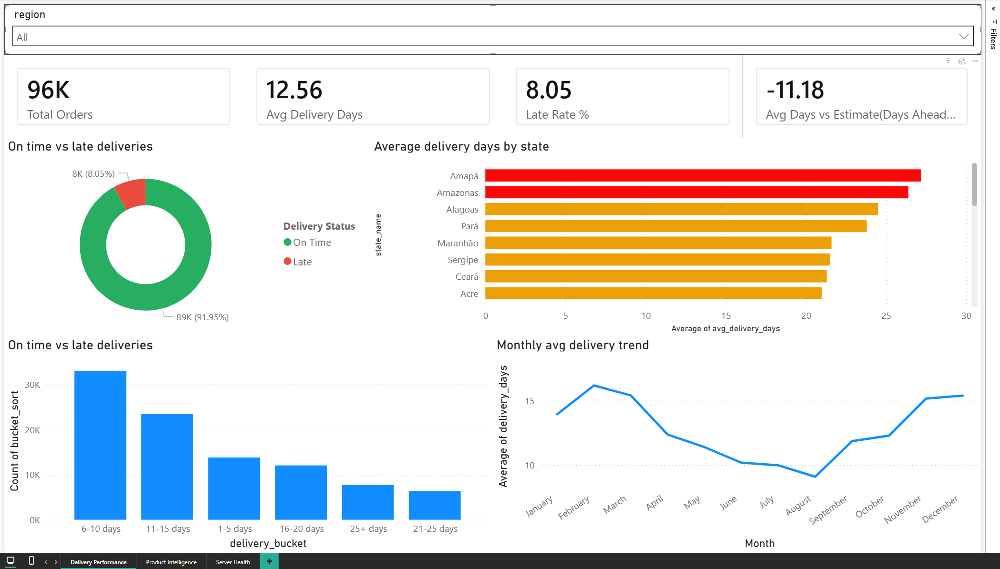
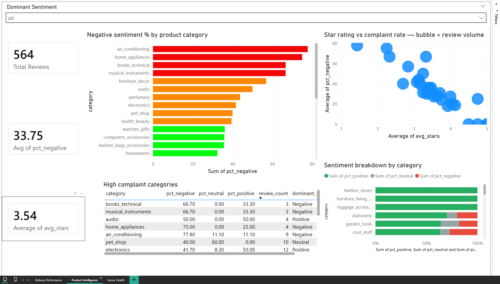
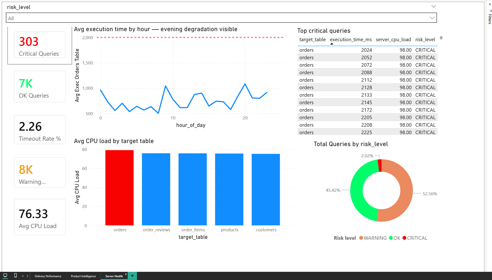

# Apex Data Migration

A full-stack data engineering project that simulates migrating a failing legacy SQL database to a modern system — diagnosing every bottleneck before touching production, running unsupervised ML anomaly detection, analysing real e-commerce delivery data, classifying Portuguese customer reviews with a local LLM, validating the entire pipeline with automated data contracts, and orchestrating all phases with a production-grade Prefect pipeline.

---

## Tech Stack

| Category | Tools |
|---|---|
| Languages | Python 3.11, SQL |
| Environment | Conda (environment.yml) |
| Orchestration | Prefect 3 — 10-task pipeline, parallel execution, retry logic |
| Data Storage | DuckDB (single source of truth), CSV (Power BI exports) |
| Data Transformation | dbt-duckdb — 7 models, 53 automated data tests |
| Data Engineering | Polars, DuckDB, PyArrow (zero-copy exchange) |
| Machine Learning | XGBoost (CPU spike prediction), Isolation Forest (anomaly detection) |
| Local AI | Ollama — Mistral 7B (Portuguese sentiment, fully offline) |
| Visualisation | Matplotlib, Seaborn, Power BI (3-page dashboard) |
| Data Quality | Custom validation framework (39 checks) + dbt tests (53 checks) |

---

## The Business Problem

A company is running its entire operation on an aging database server. It has become dangerously slow, times out during busy hours, and costs more each month to keep alive. The instinct is to "just copy the data to a new server" — but that carries huge risk: you migrate the problems with the data.

This project builds the investigation and migration-readiness pipeline that should happen before any migration:

- **Diagnose** the old server — find every problem, measure every bottleneck
- **Clean and label** the data — unsupervised ML flags anomalous queries automatically
- **Analyse** real business data — delivery performance across 96K orders, product sentiment
- **Validate** the pipeline — 94 automated checks ensure output is trustworthy
- **Transform** with dbt — staging and mart models turn raw tables into analytics-ready assets
- **Deliver** to stakeholders — Power BI dashboard with live delivery and sentiment intelligence
- **Orchestrate** everything — Prefect runs the full pipeline automatically, in the right order, with monitoring

---

## Architecture

```
┌─────────────────────────────────────────────────────────────────────┐
│                         PREFECT ORCHESTRATOR                        │
│         apex_pipeline — 10 tasks, parallel Phase 2, retries         │
└──────────────────────────────┬──────────────────────────────────────┘
                               │
┌──────────────────────────────▼──────────────────────────────────────┐
│                           DATA SOURCES                              │
│       Synthetic SQL logs (Phase 1)  │  Olist CSV dataset (Kaggle)  │
└───────────────────┬─────────────────────────────┬───────────────────┘
                    │                             │
                    ▼                             ▼
┌─────────────────────────────────────────────────────────────────────┐
│                    DuckDB  (data/apex.duckdb)                       │
│        raw_logs │ clean_logs │ delivery │ sentiment │ cat_sent      │
└─────────────────────────────┬───────────────────────────────────────┘
                              │
             ┌────────────────┴────────────────┐
             │                                 │
             ▼                                 ▼
   Polars DataFrames                    dbt-duckdb
   (ETL, feature engineering,          (staging views + mart tables,
   ML training, sentiment)              53 data tests, lineage graph)
             │                                 │
             └────────────────┬────────────────┘
                              ▼
             ┌────────────────────────────────────┐
             │           ML / AI Layer            │
             │  XGBoost │ Isolation Forest        │
             │  Mistral 7B (Ollama)               │
             └─────────────────┬──────────────────┘
                               ▼
             ┌────────────────────────────────────┐
             │    Data Validation (39 checks)     │
             │    CSV Exports + PNG Charts        │
             │    Power BI — 3-page Dashboard     │
             └────────────────────────────────────┘
```

---

## Orchestration — Prefect Pipeline

The entire project is orchestrated as a single Prefect flow. One command replaces the 7-notebook manual sequence.

### Pipeline task graph

```
Phase 1 — Server diagnosis (sequential)
  p1_generate_server_logs      15,000 synthetic logs → raw_logs in DuckDB
  p1_exploratory_analysis      SQL aggregations → identifies both injected faults
  p1_xgboost_cpu_predictor     XGBoost: 93% accuracy, ROC-AUC 0.97

Phase 2 — ETL + Delivery (parallel — both start after Phase 1 completes)
  p2_etl_anomaly_detection  ─┐ Polars ETL + Isolation Forest → clean_logs
  p2_delivery_analysis       ┘ 96,470 Olist orders → enriched delivery table

Phase 3 — AI Sentiment (sequential, after ETL)
  p3_sentiment_analysis        Mistral 7B via Ollama → sentiment labels
  p3_category_sentiment        3-table DuckDB join → category rankings

dbt — Transform + Test
  dbt_run                      Builds 7 models (4 staging views + 3 mart tables)
  dbt_test                     Runs 53 quality tests — pipeline halts on failure

Validation
  data_validation              39 custom checks across all tables and CSV exports
```

### Key design decisions

| Decision | Why |
|---|---|
| Parallel Phase 2 | ETL and delivery use independent data sources — no dependency between them |
| `retries=2, retry_delay_seconds=30` | Transient failures (DuckDB lock, Ollama timeout) self-heal |
| `os.chdir(src.parent)` before each notebook | Notebooks use relative paths — must run from their own directory |
| papermill for execution | Saves timestamped executed notebooks as audit trail |
| Prefect over Airflow | Prefect runs natively on Windows; Airflow requires POSIX OS or WSL2 |

### Final run results (accurate-toad · 17 March 2026)

| Metric | Result |
|---|---|
| Total runtime | 49 minutes 1 second |
| Task runs | 10 / 10 completed |
| dbt tests | 53 / 53 PASS |
| Custom validation checks | 39 / 39 PASS |
| Pipeline status | ✅ Completed |



---

## Power BI Dashboard

**Delivery Performance** — 96,470 orders across 27 Brazilian states: avg delivery days, late rate, regional breakdown, performance tiers, speed distribution, and month-on-month trend.

**Product Intelligence** — Category-level sentiment from Mistral 7B: avg star rating, complaint rate, dominant sentiment per product category.

**Server Health** — 15,000 server queries with CRITICAL / WARNING / OK risk classification from Isolation Forest.

---

## Phase 1 — Understanding the Old Server

**Goal:** Analyse 30 days of server behaviour and find what is broken before migration.

| Notebook | Purpose | Output |
|---|---|---|
| 1_generate_server_logs | Generates 15,000 synthetic query logs with two injected faults | raw_logs in DuckDB |
| 2_exploratory_data_analysis | DuckDB SQL aggregations → 4 diagnostic charts | PNG charts 1–4 |
| 3_predictive_model | XGBoost classifier — predicts CPU spikes before queries run | Trained model, charts 5–6 |

### Two injected production faults

**Fault 1 — Missing index on the orders table**
15% of queries against orders trigger a full table scan — taking 5–35× longer than normal queries.

**Fault 2 — Evening traffic peak**
Between 18:00–22:00, all queries run 50–90% slower due to insufficient server capacity at peak load.

### Phase 1 findings

| Metric | Value |
|---|---|
| Orders table avg execution | 590 ms — 6.4× slower than other tables |
| Evening avg execution | 434 ms vs 254 ms daytime |
| Worst single query | 10,802 ms (threshold: 2,000 ms) |
| Timeout rate | 2.96% (444 / 15,000 queries) |
| Orders table timeouts | 175 — 39% of all failures |

### XGBoost — CPU spike predictor

Trained on features available at query submission time only. No data leakage — `execution_time_ms` is excluded because it is only known after a query runs.

| Feature | Description |
|---|---|
| hour_of_day | Hour the query is submitted |
| day_of_week | Day of week |
| is_peak_hour | Between 18:00–22:00 |
| is_orders_table | Whether the query targets the orders table |
| qt_code | Query type (SELECT/INSERT/UPDATE/DELETE) |
| tbl_code | Target table encoded |

| Metric | Score |
|---|---|
| Accuracy | 93% |
| ROC-AUC | 0.97 |
| Model | 300 trees, max depth 5 |
| Features | 6 (all pre-execution — no leakage) |

---

## Phase 2 — ETL Pipeline & Anomaly Detection

**Goal:** Production-grade ETL with 12 engineered features, unsupervised anomaly detection, and delivery performance analysis across 96K real orders.

| Notebook | Purpose | Output |
|---|---|---|
| 1_ETL_and_Anomaly_Detection | 12-feature Polars ETL + Isolation Forest | clean_logs in DuckDB |
| 2_delivery_time_analysis | 96K Olist orders, delivery metrics, Power BI enrichment | delivery in DuckDB (16 cols) |

### ETL — 12 engineered features

`hour_of_day` `day_of_week` `is_peak_hour` `is_slow_query` `is_high_cpu` `is_orders_table` `qt_code` `tbl_code` `log_exec_time` `anomaly_score` `is_anomaly` `risk_level`

### Isolation Forest — unsupervised anomaly detection

No labelled data required. The model learns what "normal" looks like and flags deviations. Independently confirmed both injected faults from Phase 1.

| Risk Level | Share | Definition |
|---|---|---|
| CRITICAL | ~4% | Anomaly + high CPU + slow query simultaneously |
| WARNING | ~25% | At least one risk factor present |
| OK | ~71% | Normal behaviour |

### Delivery analysis — 96,470 real orders

| Metric | Value |
|---|---|
| Orders analysed | 96,470 delivered orders |
| National avg delivery | 12.5 days |
| Late deliveries | 8.05% |
| Fastest region | South — 7.7 days avg |
| Slowest region | North — 26.2 days avg |
| Power BI columns | 16 (includes region, performance_flag, delivery_bucket, estimate_label) |

---

## Phase 3 — AI Customer Intelligence

**Goal:** Use a locally-hosted LLM to classify Portuguese customer reviews and connect sentiment to product categories.

| Notebook | Purpose | Output |
|---|---|---|
| 1_sentiment_analysis_engine | Mistral 7B classifies 500 reviews via Ollama | sentiment in DuckDB |
| 2_category_sentiment | 3-table join links sentiment to product categories | category_sentiment in DuckDB |

### Why Mistral replaced VADER

| | VADER (dropped) | Mistral 7B via Ollama |
|---|---|---|
| Language support | English only | Multilingual — Portuguese native |
| Result on this dataset | 81% Neutral — effectively useless | Meaningful 3-way distribution |
| Cost | Free | Free (runs locally after one download) |
| Privacy | N/A | Fully offline — no review text leaves the machine |
| Validated against star ratings | Failed | Passes — 5-star reviews skew Positive |

### Sentiment distribution (500 reviews)

| Label | Count | Share |
|---|---|---|
| Positive | 291 | 49% |
| Negative | 203 | 34% |
| Neutral | 100 | 17% |

---

## dbt Layer

**Goal:** Move aggregation logic out of notebooks into versioned, tested, documented SQL models.

```
dbt_apex/
└── models/
    ├── staging/   — views on top of raw DuckDB tables
    │   ├── stg_server_logs.sql
    │   ├── stg_clean_logs.sql
    │   ├── stg_delivery_orders.sql
    │   └── stg_reviews.sql
    └── marts/     — materialised tables for analytics
        ├── fct_server_health.sql
        ├── fct_delivery_by_state.sql
        └── dim_category_sentiment.sql
```

| Metric | Value |
|---|---|
| Models | 7 (4 staging views + 3 mart tables) |
| Data tests | 53 — all passing |
| Test types | not_null, unique, accepted_values |
| Adapter | dbt-duckdb 1.10.1 |
| Docs | `dbt docs serve` → http://localhost:8080 |

### dbt lineage graph



### Power BI Dashboard







---

## Data Validation Framework

A custom `data_validation.ipynb` runs 39 checks across all DuckDB tables and CSV exports after every pipeline run.

| Check type | Examples |
|---|---|
| Table existence | All 5 tables present in DuckDB |
| Row counts | raw_logs = 15,000; delivery > 90,000 |
| Null checks | No nulls in key columns |
| Value contracts | sentiment ∈ {Positive, Neutral, Negative} |
| Business sanity | Late rate in 2–20%; avg delivery 5–30 days |
| Cross-phase integrity | clean_logs row count = raw_logs |
| CSV contracts | All 6 output files exist with required columns |

The validation notebook caught a real production bug: Mistral returning invalid labels (`Mixed`, `Super recomendo`) — fixed before the data reached Power BI.

---

## Engineering Problems Solved

Real bugs encountered and fixed during development.

**1. DuckDB file locking across Jupyter kernels**
Multiple kernels opened write connections simultaneously. Interrupted cells left locks unreleased, causing `IOException: file already open`.
Fix: All read-only notebooks use `duckdb.connect(path, read_only=True)`. Write connections use context managers scoped to a single cell.

**2. PyArrow missing — silent database corruption**
DuckDB needs PyArrow to register Polars DataFrames. When absent, the exception was swallowed, leaving a 12 KB empty database that appeared valid.
Fix: Added `pyarrow>=14.0.0` explicitly to requirements.txt with a comment explaining why it cannot be removed.

**3. VADER returning 81% Neutral on Portuguese reviews**
VADER is English-only. The Olist reviews are Brazilian Portuguese — VADER scored every unknown word as 0.0.
Fix: Replaced VADER entirely with Mistral 7B via Ollama. Results validated against star ratings.

**4. Data leakage in XGBoost CPU predictor**
`execution_time_ms` was in the feature set. You cannot know how long a query takes before it runs.
Fix: Removed `execution_time_ms`. Added `is_orders_table` as a replacement. Model now uses only features available at query submission time.

**5. Mistral returning invalid sentiment labels**
Mistral occasionally returned freeform labels (`Mixed`, `Super recomendo`) instead of Positive/Neutral/Negative, silently corrupting the sentiment table.
Fix: Added `sanitise()` function with keyword matching. Caught by the data validation framework before Power BI was affected.

**6. Category sentiment threshold too aggressive**
`review_count >= 20` filter with only 500 sampled reviews left almost no categories — empty charts and empty mart tables.
Fix: Dynamic threshold: `max(3, min(20, total_reviews // 100))`. Scales correctly from small sample runs to full dataset.

**7. Large Kaggle CSVs committed to Git**
159 MB of Olist CSVs in the repo, including a 59 MB geolocation file never used by any notebook.
Fix: `data/*.csv` added to `.gitignore`. Unused CSVs deleted. `data/.gitkeep` preserves the directory.

**8. Notebook relative paths breaking under Prefect orchestration**
Papermill executes notebooks from the `airflow_orchestration/` directory. Notebooks using `../data/` paths failed with FileNotFoundError.
Fix: `os.chdir(src.parent)` before each papermill execution — each notebook runs from its own directory, restoring the original working directory in a `finally` block.

---

## Data Flow

| Table | Rows | Written by | Read by |
|---|---|---|---|
| raw_logs | 15,000 | Phase 1 / Nb 1 | Phase 1 Nb 2 & 3, Phase 2 Nb 1, dbt |
| clean_logs | 15,000 | Phase 2 / Nb 1 | dbt fct_server_health |
| delivery | 96,470 | Phase 2 / Nb 2 | Power BI, dbt fct_delivery_by_state |
| sentiment | 500 | Phase 3 / Nb 1 | Phase 3 Nb 2, dbt stg_reviews |
| category_sentiment | 594 | Phase 3 / Nb 2 | Power BI, dbt dim_category_sentiment |

---

## Project Structure

```
Apex-Data-Migration/
│
├── environment.yml                        # Conda — Python 3.11 + all dependencies
├── requirements.txt                       # Pip dependencies
│
├── airflow_orchestration/                 # Prefect orchestration layer
│   ├── apex_flow.py                       # 10-task Prefect flow
│   ├── README.md                          # Orchestration docs
│   └── dags/
│       └── profiles.yml                   # dbt DuckDB connection profile
│
├── Phase_1_Infrastructure/
│   ├── 1_generate_server_logs.ipynb       # 15K synthetic logs, 2 injected faults
│   ├── 2_exploratory_data_analysis.ipynb  # DuckDB SQL + Matplotlib, 4 charts
│   ├── 3_predictive_model.ipynb           # XGBoost CPU spike predictor
│   └── RESULTS.md
│
├── Phase_2_Data_Pipeline/
│   ├── 1_ETL_and_Anomaly_Detection.ipynb  # 12-feature ETL + Isolation Forest
│   ├── 2_delivery_time_analysis.ipynb     # 96K orders, 16-column enriched output
│   └── RESULTS.md
│
├── Phase_3_AI_Agents/
│   ├── 1_sentiment_analysis_engine.ipynb  # Mistral 7B Portuguese sentiment
│   ├── 2_category_sentiment.ipynb         # 3-table join, category rankings
│   └── RESULTS.md
│
├── dbt_apex/                              # dbt transformation layer
│   ├── dbt_project.yml
│   ├── profiles.yml.example
│   └── models/
│       ├── staging/                       # 4 views + sources.yml + schema.yml
│       └── marts/                         # 3 tables + schema.yml
│
├── data_validation.ipynb                  # 39-check pipeline health monitor
├── data/
│   ├── apex.duckdb                        # Single source of truth (not in Git)
│   ├── *.csv                              # Raw data + exports (not in Git)
│   └── figures/                           # 13 PNG charts (committed)
│
└── images/
    └── dbt_lineage.png                    # dbt model lineage graph
```

---

## How to Run

### Option A — Prefect orchestration (recommended)

Runs the full pipeline automatically in one command.

```bash
# Prerequisites: conda env active, Olist CSVs in data/, Ollama running with mistral pulled

conda activate apex-migration
cd airflow_orchestration
python apex_flow.py
```

Monitor at `http://127.0.0.1:4200` (start `prefect server start` in a second terminal).

### Option B — Manual notebook execution

**1. Create the environment**
```bash
conda env create -f environment.yml
conda activate apex-migration
python -m ipykernel install --user --name apex-migration --display-name "Python 3 (apex-migration)"
```

**2. Install Ollama + Mistral (Phase 3 only)**
```bash
# Download from ollama.com, then:
ollama pull mistral
# Leave `ollama serve` running before Phase 3 notebooks
```

**3. Download the Olist dataset**
Download the [Brazilian E-Commerce dataset](https://www.kaggle.com/datasets/olistbr/brazilian-ecommerce) from Kaggle and place all CSVs into `data/`.

**4. Run notebooks in order**
Use Kernel → Restart & Run All. Each notebook writes to DuckDB — do not skip steps.

```
Phase_1 / 1_generate_server_logs        → DuckDB: raw_logs
Phase_1 / 2_exploratory_data_analysis   → charts 1–4
Phase_1 / 3_predictive_model            → charts 5–6
Phase_2 / 1_ETL_and_Anomaly_Detection   → DuckDB: clean_logs
Phase_2 / 2_delivery_time_analysis      → DuckDB: delivery
Phase_3 / 1_sentiment_analysis_engine   → DuckDB: sentiment
Phase_3 / 2_category_sentiment          → DuckDB: category_sentiment
data_validation                         → 39-check pipeline health report
```

**5. Run dbt**
```bash
conda activate apex-migration
cd dbt_apex
dbt run                                  # build 7 models
dbt test                                 # run 53 data tests — all must pass
dbt docs generate && dbt docs serve      # lineage graph at localhost:8080
```

**6. Refresh Power BI**
Point each data source to the CSV files in your local `data/` folder, then refresh all.

---

## Key Technical Decisions

| Decision | Why |
|---|---|
| DuckDB over SQLite | Columnar, analytical, native Polars/Arrow support, zero config |
| Polars over Pandas | 5–10× faster, Rust-backed, zero-copy Arrow exchange with DuckDB |
| Isolation Forest over rules | Unsupervised — finds anomalies we didn't know to look for |
| Mistral over VADER | Portuguese-native multilingual LLM vs English-only dictionary |
| Ollama over cloud APIs | Free, offline, no API key, no customer data leaves the machine |
| dbt over raw SQL scripts | Versioned models, automated tests, lineage graph, docs site |
| Prefect over Airflow | Native Windows support, simpler setup, growing enterprise adoption |
| read_only connections | Prevents write lock contention across Jupyter kernels |
| Context managers | `with duckdb.connect()` guarantees lock release even on exception |
| One DuckDB file | Single source of truth — no CSV hand-offs between phases |